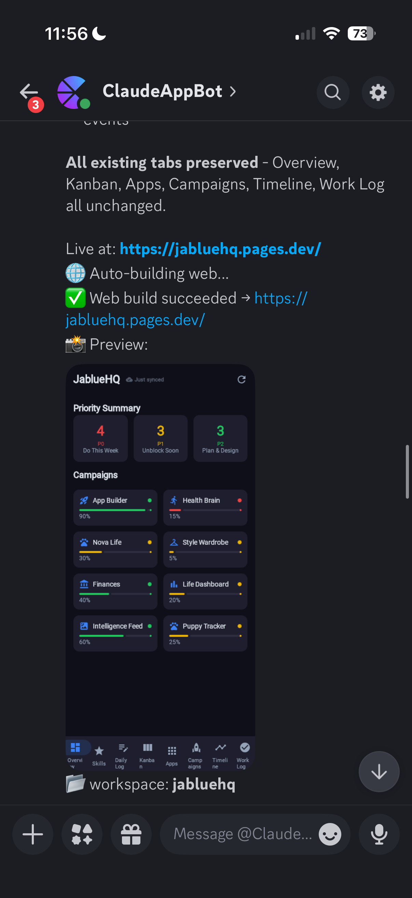

# discord-claude-app-builder

**Type an idea in Discord. Get a native app on the App Store.**

Android, iOS, and Web from one chat command. Auto-fixing build loop. One-tap publish to TestFlight and Google Play. macOS required for iOS.

<table>
  <tr>
    <td align="center">
      
    </td>
    <td align="center">
      
    </td>
    <td align="center">
      
    </td>
       <td align="center">
      
    </td>
  </tr>
</table>

**And the bot improves itself.** Every app I ship by hand becomes a benchmark. A parallel bot-only copy gets built on every commit, an auditor diffs the two, and gaps become prompt-fix PRs against this repo. [WereSoBach](https://weresobach.com) is the first reference app — every future app I (or anyone) ships through this pipeline plugs into the same loop.

Live dashboard: **[app-bot-diff-dashboard.pages.dev](https://app-bot-diff-dashboard.pages.dev)**

*(Demo GIF coming soon.)*

**Building your own client?** See the full **[API Documentation](API.md)**.

## What makes this different

Most app builders give you a web preview. This one gives you **real native apps** that run on phones and ship to app stores.

- **From chat to App Store** — type a description, get a running app on all three platforms, publish to TestFlight or Google Play without leaving Discord
- **Actually cross-platform** — Kotlin Multiplatform under the hood, not a web wrapper. Native performance on Android + iOS, WebAssembly on the web
- **Native iOS option** — `/swiftui` converts the iOS layer to real SwiftUI for an app that feels native, not ported
- **Auto-fix loop** — build errors get fed back to the AI automatically, up to 8 retries. Crash-on-launch detection catches runtime failures too
- **Database included** — Supabase backend auto-provisioned per app with real-time sync via WebSocket
- **Visual debugging** — paste a screenshot of a bug and the bot sees it, understands it, and fixes it
- **Self-healing infrastructure** — when things break, the bot files a GitHub issue and opens a fix PR automatically

## Quick start

DM the bot:

```
/buildapp a pomodoro timer with task categories and a rest timer
```

Wait a few minutes. You get a web link to try it instantly, plus native builds for Android and iOS.

Then iterate in natural language:

```
@pomodoro add a dark mode toggle
@pomodoro make the timer bigger with a circular progress bar
```

See a bug? Paste a screenshot — the bot reads images and fixes what it sees.

When you're happy:

```
/testflight    → publishes to iOS TestFlight
/playstore     → publishes to Google Play
```

That's it.

## Commands

### Build and preview

| Command | What it does |
|---------|-------------|
| `/buildapp <description>` | Full pipeline: scaffold, build, auto-fix, demo |
| `/planapp <description>` | Plan first — screens, data model, features — before building |
| `/demo [web\|android\|ios]` | Build and preview (screenshot + web link) |
| `/build [android\|ios\|web]` | Build a specific platform target |
| `/appraise` | AI quality review against app store guidelines |

### Chat with your app

| Command | What it does |
|---------|-------------|
| `@appname <request>` | Make changes to a specific app |
| *just type a message* | Chat about the currently active app |
| *paste an image* | Bot sees screenshots — show it bugs or design mockups |

### Publish

| Command | What it does |
|---------|-------------|
| `/testflight` | Archive, sign, and upload to iOS TestFlight |
| `/playstore` | Build AAB and upload to Google Play internal testing |
| `/swiftui` | Convert iOS layer to native SwiftUI (admin) |

### Manage workspaces

| Command | What it does |
|---------|-------------|
| `/ls` | List all apps, switch between them |
| `/use <name>` | Switch to a workspace |
| `/rename <new name>` | Rename current app |
| `/remove <name>` | Delete an app |

### Save and version control

| Command | What it does |
|---------|-------------|
| `/save` | Checkpoint your work |
| `/save <message>` | Save with a custom description |
| `/save list` | Browse save history, restore any version |
| `/save undo` / `redo` | Quick undo/redo |
| `/save github` | Push to GitHub (admin) |
| `/status` `/diff` `/commit` `/log` `/pr` | Full git workflow (admin) |

### Data

| Command | What it does |
|---------|-------------|
| `/data export` | Download all database tables as CSV |
| `/data template` | Get empty CSV templates to fill in |
| `/data import` | Bulk-import a CSV file |

### Tools and admin

| Command | What it does |
|---------|-------------|
| `/spend` | Daily budget and usage |
| `/history` | Build history, fix loops, cost tracking |
| `/analytics` | TestFlight, Play Store, and build health metrics |
| `/allow @user` | Grant bot access |
| `/collaborate <ws> <name> <email>` | Invite a collaborator to a workspace |
| `/run <cmd>` | Run a shell command in the workspace (admin) |
| `/help` | Full command reference |

## Tips

- **Be specific.** "A workout tracker with sets/reps logging, a rest timer, and exercise categories" beats "a fitness app."
- **Iterate small.** Build the core first, then add features one prompt at a time.
- **Paste screenshots.** The bot reads images — show it bugs, design mockups, or reference apps.
- **Save often.** `/save` creates undo points. Use `/save list` to roll back if something breaks.
- **Use `/planapp` first** for complex apps. It generates a structured plan (screens, data model, navigation) that guides the build.

## How it works

```
You (Discord) ──→ Parser ──→ Bot ──→ Handler
                                       │
                               Claude Code CLI ←──→ AI (reads + writes code)
                                       │
                               Agent Loop (build → error → fix → retry)
                                       │
                               Platforms (Gradle / Xcode / WebAssembly)
                                       │
                               Screenshots, web server, device install
```

**Under the hood:**

1. **You describe what you want** in Discord (text, images, or both)
2. **Claude writes Kotlin Multiplatform code** — shared business logic + Compose UI
3. **The agent loop compiles it** for Android, Web, and iOS. If the build fails, the error is fed back to Claude, which fixes it and retries (up to 8 times)
4. **Crash detection** — if the app compiles but crashes on launch, the bot catches it, reads the crash log, and auto-fixes
5. **You see a preview** — web URL you can open anywhere, plus native screenshots from emulator/simulator
6. **You iterate** — every message adds to the conversation. Claude remembers what it built and evolves the app incrementally
7. **You publish** — `/testflight` handles the entire Apple signing + upload flow. `/playstore` builds a signed AAB and uploads to Google Play

**Auto-fix in action:**

The bot doesn't just build — it watches for failures at every stage and automatically tries to fix them. If it can't fix an issue after multiple attempts, it files a GitHub issue with full error context and spawns a background agent to open a fix PR.

**Native SwiftUI (optional):**

By default, iOS apps use Compose Multiplatform (shared UI with Android). Run `/swiftui` to convert the iOS layer to native SwiftUI — SF Symbols, NavigationStack, native sheets, native scroll physics — while keeping the shared Kotlin business logic. The result feels like a hand-written iOS app.

---

*Everything below is for self-hosting or contributing.*

## Setup

<details>
<summary><b>Prerequisites</b></summary>

- macOS (needed for iOS builds; Android + Web work on Linux)
- Python 3.10+
- [Claude Code CLI](https://docs.anthropic.com/en/docs/claude-code) installed and authenticated
- Android SDK with an AVD configured
- Xcode (optional, for iOS)
- A Discord bot token ([create one](https://discord.com/developers/applications))

</details>

```bash
git clone https://github.com/jardysuntan/discord-claude-app-builder.git
cd discord-claude-app-builder
pip install -r requirements.txt
cp .env.example .env   # edit with your values
```

**Minimum `.env`:**

```bash
DISCORD_BOT_TOKEN=your-bot-token
DISCORD_ALLOWED_USER_ID=your-discord-user-id
BASE_PROJECTS_DIR=~/Projects
CLAUDE_BIN=claude
```

**Run:**

```bash
pm2 start ecosystem.config.cjs   # recommended — auto-restarts
# or: python3 bot.py
```

<details>
<summary><b>iOS / TestFlight setup</b></summary>

```bash
sudo xcode-select -s /Applications/Xcode.app/Contents/Developer
sudo xcodebuild -license accept

# TestFlight (requires Apple Developer Program, $99/yr):
export APPLE_TEAM_ID=your-team-id
export ASC_KEY_ID=your-key-id
export ASC_ISSUER_ID=your-issuer-id
# Place .p8 at ~/.private_keys/AuthKey_<KEY_ID>.p8
```

</details>

<details>
<summary><b>Supabase (auto-provisions databases per app)</b></summary>

```bash
SUPABASE_PROJECT_REF=your-project-ref
SUPABASE_MANAGEMENT_KEY=your-management-key
SUPABASE_ANON_KEY=your-anon-key
```

Each `/buildapp` run gets its own isolated Postgres schema. Tables are designed by the AI based on the app description. Real-time sync via WebSocket is set up automatically.

</details>

<details>
<summary><b>Google Play setup</b></summary>

```bash
PLAY_JSON_KEY_PATH=path/to/service-account.json
```

Requires a Google Play Developer account ($25 one-time) and a service account with Google Play Developer API access. The first APK must be uploaded manually; after that `/playstore` handles everything.

</details>

## Architecture

<details>
<summary><b>Project structure</b></summary>

```
bot.py                  # Entry point — Discord client, message routing
parser.py               # 48 slash commands + @workspace prompt parsing
config.py               # Environment variables and validation
platforms.py            # Build/install/demo for Android, iOS, Web
claude_runner.py        # Claude Code CLI wrapper with session persistence
agent_loop.py           # Auto-fix loop: build → error → Claude fix → rebuild
agent_protocol.py       # Provider-agnostic agent runner contract
agent_factory.py        # Runner selection (Claude default, extensible)
workspaces.py           # Workspace registry (JSON-backed, per-user)
workspace_spec.py       # Persistent product specs (.bridge/workspace_spec.json)
supabase_client.py      # Supabase Management API client
asc_api.py              # App Store Connect API client
play_api.py             # Google Play Developer API client
handlers/
  prompt_handler.py     # Core prompt flow (images, Claude, auto-build, preview)
  build_commands.py     # /buildapp, /demo, /platform
  publish_commands.py   # /testflight, /playstore
  swiftui_commands.py   # /swiftui (native iOS conversion)
  workspace_commands.py # /ls, /use, /rename, /help
  save_git_commands.py  # /save, git operations
  admin_commands.py     # /allow, /setcap, /run, /invite
  system_commands.py    # /spend, /health, /analytics, /setup
  data_commands.py      # /data export, import, template
helpers/
  error_reporter.py     # Auto-file GitHub issues + async fix PRs
  demo_runner.py        # Platform demo orchestration
  autofix.py            # Auto-fix PR on smoke test failure
  web_screenshot.py     # Playwright headless screenshots
  smoketest_runner.py   # Multi-scenario smoke test engine
commands/
  buildapp.py           # Full build pipeline with context-aware prompts
  swiftui.py            # SKIE setup + Compose-to-SwiftUI conversion
  testflight.py         # iOS archive, export, validate, upload
  playstore.py          # Android AAB build + Google Play upload
  analytics.py          # TestFlight, Play Store, build health metrics
  create.py             # KMP project scaffolding
  planapp.py            # Structured app planning
api.py                  # REST API (port 8100, 26 endpoints)
```

</details>

## Smoke tests

Automated end-to-end tests verify the full pipeline works. Three scenarios:

| Scenario | What it builds |
|----------|---------------|
| `counter` | Counter app with increment/decrement/reset buttons |
| `map` | Location finder with Leaflet.js map and markers |
| `video` | TikTok-style vertical video feed with play/pause |

```bash
python -m commands.smoketest --scenario counter   # single scenario
python -m commands.smoketest --scenario all        # all scenarios
python -m commands.smoketest --api                 # API endpoint tests
```

On failure, the bot automatically files a GitHub issue and opens a fix PR.

A nightly cron runs `scripts/nightly-smoketest.sh` and posts results to the `#smoke-tests` channel.

## Bot learning loop (how it works)

Summarized at the top — this section covers the implementation. Every commit to a reference repo (currently [WereSoBach](https://weresobach.com)) triggers the bot to rebuild the same feature in a parallel bot-only copy. An auditor scans for missing patterns (auth, real-time sync, maps, games, etc.). Gaps open draft PRs here with suggested prompt improvements.

The [dashboard](https://app-bot-diff-dashboard.pages.dev) renders each commit as a CI/CD-style pipeline row: `Commit → Phase 2 sync → Bottest → Phase 3 audit → Gap PR`. Source in [`app-bot-diff-dashboard/`](app-bot-diff-dashboard/) — Cloudflare Pages static site plus a Pages Function proxying the GitHub API.

## API

A REST API runs on port 8100 for programmatic access to all bot functionality.

**Auth:** Bearer token (auto-generated, stored in `.api-token`).

| Method | Endpoint | Description |
|--------|----------|-------------|
| `POST` | `/buildapp` | Build a full app from a description |
| `GET` | `/builds/{build_id}` | Poll build status |
| `POST` | `/planapp` | Generate an app plan |
| `GET` | `/workspaces` | List all workspaces |
| `GET` | `/workspaces/{slug}` | Workspace details |
| `POST` | `/workspaces/{slug}/prompt` | Send a prompt to Claude |
| `POST` | `/workspaces/{slug}/build` | Build for a platform |
| `POST` | `/workspaces/{slug}/demo` | Run a demo |
| `POST` | `/workspaces/{slug}/save` | Save workspace |
| `POST` | `/workspaces/{slug}/appraise` | Quality appraisal |
| `GET` | `/workspaces/{slug}/git/status` | Git status |
| `POST` | `/workspaces/{slug}/git/commit` | Commit changes |

Full spec: `http://localhost:8100/api/docs` (interactive Swagger UI when running).

## License

MIT
